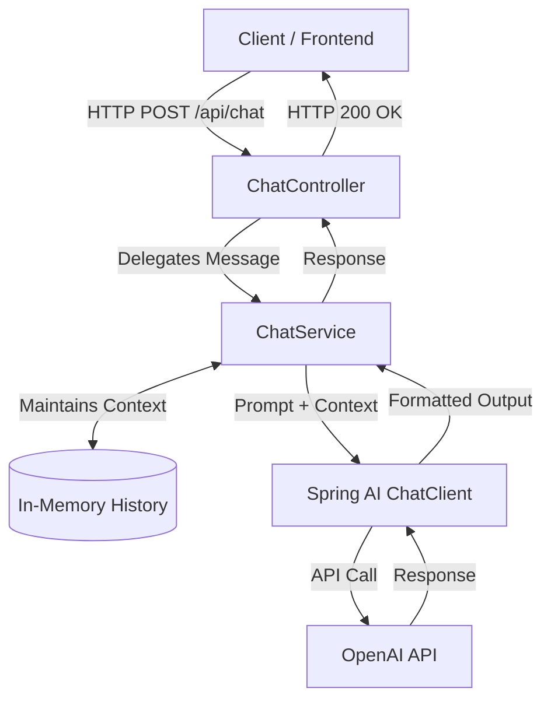

<div align="center">
  <h1>Snippit AI Chatbot Backend</h1>
  <p><i>An intelligent, context-aware customer support assistant for Snippit</i></p>
  
  <p>
    
    
    
    
  </p>
</div>

<br/>

Welcome to the backend service for **Snippit AI**! This application serves as a professional and friendly customer-support assistant for the Snippit quick-commerce application. 

Powered by **Java**, **Spring Boot**, and **Spring AI**, it leverages OpenAI's advanced LLMs (such as `gpt-4o` or free-tier equivalents) to provide intelligent, context-aware responses regarding order tracking, deliveries, cancellations, refunds, payments, and company policies.

---

## ✨ Key Features

- **💬 Conversational AI:** Maintains chat history per session to provide highly contextual and coherent answers.
- **🛡️ Strict Guardrails:** The AI is strictly instructed to *only* answer questions related to the Snippit application. It is programmed to never hallucinate order details, tracking numbers, or internal policies.
- **🚀 RESTful Endpoints:** Clean, simple, and easy-to-integrate API endpoints for seamless frontend consumption.
- **🧠 Spring AI Integration:** Built on top of the robust Spring AI framework, making LLM interactions declarative and maintainable.

---

## 🛠️ Tech Stack

| Technology | Description |
| :--- | :--- |
| **Java 25** | Core programming language |
| **Spring Boot 4.1.1** | Application framework and REST API |
| **Spring AI 2.0.1** | AI framework for seamless integration with OpenAI |
| **Maven** | Dependency management and build tool |

---

## 🏗️ Architecture & High-Level Design (HLD)

This project is built using the **Spring AI** framework. Instead of making raw HTTP calls to OpenAI, the application leverages Spring AI's abstractions to seamlessly connect with Large Language Models (LLMs).



1. **Spring AI Starter:** The project uses `spring-ai-starter-model-openai`, which automatically pulls in the core `spring-ai-core` framework dependencies.
2. **ChatClient Integration:** The `ChatService` uses Spring AI's `ChatClient` builder to configure the conversational model and system prompts.
3. **Message Abstraction:** The conversational history is maintained using Spring AI's native message types (`UserMessage`, `AssistantMessage`), meaning the application logic is decoupled from any specific LLM provider.

---

## 📁 Project Structure

```text
src
 └── main
     ├── java/com/maxx/chatbot
     │   ├── ChatbotApplication.java   # Main Spring Boot Application entry point
     │   ├── controller
     │   │   └── ChatController.java   # REST Controller handling API routes
     │   └── service
     │       └── ChatService.java      # Core business logic & Spring AI integration
     └── resources
         └── application.properties    # Configuration file (ports, keys, etc.)
```

---

## 📋 Prerequisites

Before you begin, ensure you have met the following requirements:
- **Java 25** (or compatible modern Java version) installed on your machine.
- An **OpenAI API Key** with sufficient credits/quota.

---

## ⚙️ Configuration

The application requires your OpenAI API key to communicate with the models. You must set this as an environment variable before starting the application.

<details>
<summary><b>Windows (Command Prompt)</b></summary>

```cmd
set OPENAI_API_KEY=your_api_key_here
```
</details>

<details>
<summary><b>Windows (PowerShell)</b></summary>

```powershell
$env:OPENAI_API_KEY="your_api_key_here"
```
</details>

<details>
<summary><b>macOS / Linux</b></summary>

```bash
export OPENAI_API_KEY="your_api_key_here"
```
</details>

> 💡 **Pro Tip:** The `.gitignore` file is configured to exclude `.env` and `application-secret.properties`. You can safely use these files for local development by configuring Spring Boot to read them.

---

## 🚀 Getting Started

You don't need to have Maven installed locally to run this project. You can run the application using the provided Maven wrapper (`mvnw`).

1. **Clone the repository** and navigate to the root directory.
2. **Start the application** using the wrapper:

**Windows:**
```powershell
.\mvnw.cmd spring-boot:run
```

**macOS / Linux:**
```bash
./mvnw spring-boot:run
```

Once running, the server will be available at: `http://localhost:8080`

---

## 📡 API Endpoints

### 1. Chat with the AI

Send a message to the chatbot and receive an intelligent response. The chatbot automatically remembers the conversation context.

- **URL:** `/api/chat`
- **Method:** `POST`
- **Headers:** `Content-Type: text/plain`
- **Body:** `String` (The user's query)
- **Response:** `String` (The AI's response)

**Example Request:**
```bash
curl -X POST http://localhost:8080/api/chat \
     -H "Content-Type: text/plain" \
     -d "Where is my order #12345?"
```

### 2. Clear Chat History

Clear the current conversation history. Useful for resetting the context and starting a fresh conversation.

- **URL:** `/api`
- **Method:** `DELETE`
- **Response:** `200 OK`

**Example Request:**
```bash
curl -X DELETE http://localhost:8080/api
```

---

## ☁️ Deployment / GitHub Setup

If you are setting this up as a brand new repository, you can push your local code to GitHub using the following commands:

```bash
git init
git add .
git commit -m "First commit: Snippit AI Chatbot Backend setup"
git branch -M main
git remote add origin https://github.com/madebymaxx/snippit-ai-chatbot-backend.git
git push -u origin main
```

---


## 🧪 Testing

To ensure everything is working correctly, you can run the unit and integration test suite:

**Windows:**
```powershell
.\mvnw.cmd test
```

**macOS / Linux:**
```bash
./mvnw test
```

---

## 👨‍💻 Developer / Author

**Max (Nikhil Singh)**
- **GitHub:** [@madebymaxx](https://github.com/madebymaxx)

---

<div align="center">
  <i>Made by Max</i>
</div>
